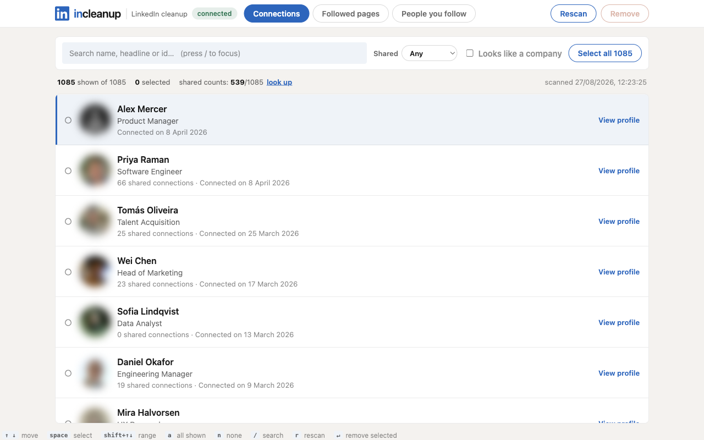
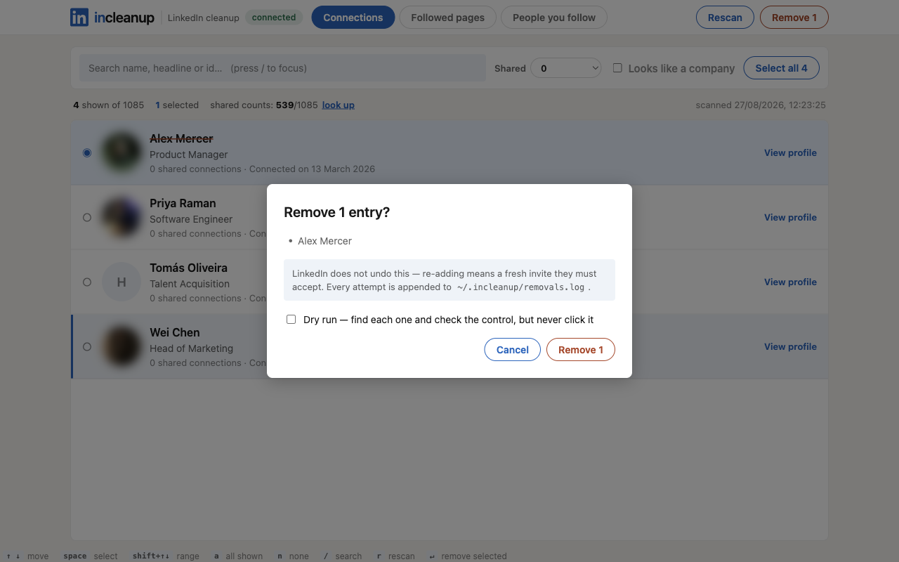
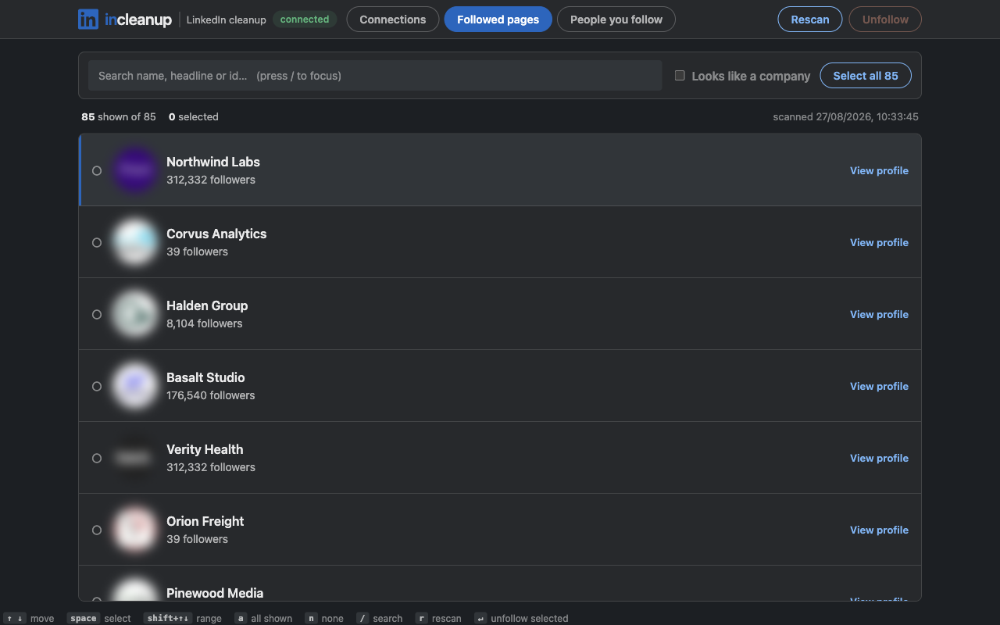
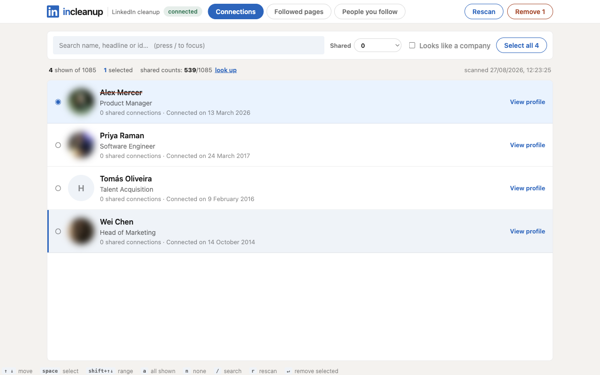

# LinkedIn Cleanup

**incleanup** — clean up your LinkedIn from your keyboard: prune connections you
no longer recognise, and pages and people cluttering your feed.

It reads your lists into a fast local list. You pick with `↑` `↓` and `space`,
press `↵`, and it does the clicking for you.

Nothing leaves your machine. No account, no API key — and incleanup never sees
or asks for your LinkedIn password.



## Install

```bash
npm install
```

## Use it

**1. Open the browser.**

```bash
npm run chrome
```

A browser window opens on LinkedIn. **Log in there** — just this once, the
session is remembered.

> It is a separate browser profile, not the one you browse with. That is
> required: Chrome refuses to be automated on your normal profile.
> Use `npm run brave` if you prefer Brave.

**2. Start incleanup.**

```bash
npm run dev
```

**3. Open http://localhost:5273** and press `r` to scan.

The first scan of a large network takes a few minutes. It saves as it goes, so
stopping halfway is fine.

**4. Pick people, then press `↵`.**

Move with `↑` `↓`, mark with `space`. Confirm, and it works through your list.



## The three tabs

| Tab | What it cleans |
| --- | --- |
| **Connections** | People you are connected to → removes the connection |
| **Followed pages** | Company pages in your feed → unfollows |
| **People you follow** | People you follow without being connected → unfollows |

Each tab scans separately — press `r` on each one.



## Finding who to remove

- **Type to search** — name, job title, or profile link.
- **Shared** — how many connections you have in common. Pick `0` to find people
  with no overlap with your network at all. Needs the **look up** link in the
  status bar first (a few minutes; LinkedIn only tells us for about 1,000
  people, the rest stay `Unknown`).
- **Looks like a company** — flags profiles that read like a brand or agency.
  It is a guess, so hover the `company?` tag to see why it was flagged.
- **Select all** takes everything currently shown — filter first, then select
  all, then remove.

Filtered to people you share no connections with, three of them marked:



## Keys

| Key | |
| --- | --- |
| `↑` `↓` | Move |
| `space` | Mark / unmark |
| `shift` + `↑` `↓` | Mark a range |
| `a` | Mark everything shown |
| `n` | Clear marks |
| `/` | Search (`esc` to leave) |
| `r` | Rescan |
| `↵` | Act on what you marked |
| `d` | Toggle dry run, in the confirm box |

## Before you remove people

**Removing a connection cannot be undone.** Getting someone back means sending a
new invite they have to accept. Unfollowing is safe — you can follow again.

Three things protect you:

- **Dry run** (`d` in the confirm box) finds everyone you marked and checks it
  can reach the remove button, without clicking it. Nothing is removed.
- **A log** of every attempt is kept at `~/.incleanup/removals.log`, so you can
  look up anyone you cut by mistake.
- **Limits per run**: 100 removals, 500 unfollows. Roughly 5 seconds each, so
  100 people takes about 8 minutes.

That pause between actions is on purpose. LinkedIn restricts accounts that act
in a steady machine rhythm, so let it take its time.

## If something goes wrong

**"browser not attached"** — the browser from step 1 is closed. Run
`npm run chrome` again.

**"not logged in"** — log in to LinkedIn in that browser window, then reload
the page.

**A scan finds far fewer people than LinkedIn says** — scroll the LinkedIn
connections page yourself for a moment and scan again; LinkedIn sometimes stops
feeding rows.

**Profile photos missing** — they are served through incleanup itself so
blockers do not drop them. If one still fails, the row shows the person's
initials instead.

**Something says "failed"** — nothing was removed for that person. The message
says what it hit. Rescan (`r`) and try that one again.

## Notes

Screenshots use blurred photos and made-up names — the real lists are full of
real people. `npm run screenshots` regenerates them the same way.

Not affiliated with, endorsed by, or connected to LinkedIn. It drives your own
account, in your own browser, on your own machine.

Automating your own account is your call and your risk — LinkedIn's User
Agreement discourages automated access regardless of intent.

LinkedIn changes these pages often. If scans come back empty or actions start
failing, [docs/internals.md](docs/internals.md) explains how each page is read
and where the selectors live.

## License

MIT
